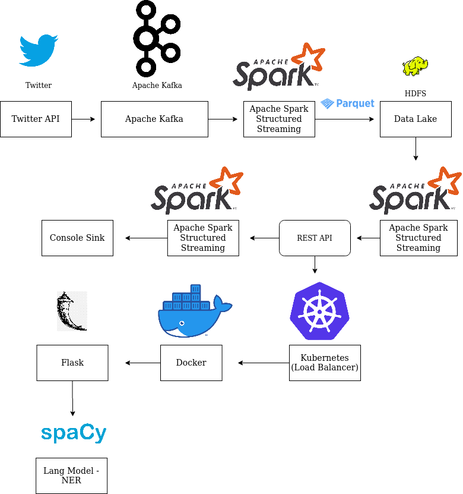

# Scalable REST end point a naive approach

## Requirements  

- Build a naive approach for a scalable back end loading the spaCy model (12MB) and serve them over a REST end point with Kubernetes
- Perform NLP task called NER with spaCy

------------------------------------------------------------------------------------------------------------------------

## Implementation

- Design Flask application with a end point to do spaCy NER 
- Define Docker with flask application
- Define Kubernetes service and deployment file
- Run as Kubernetes application

`Bronze Lake/Live Stream -> Spark Structured Streaming Parquet Source -> Extract NER Tags from text with UDF -> Spark Structured Streaming Console Sink`

`Extract NER Tags from text with UDF : Raw Text -> REST API end point -> Kubernetes -> Docker -> Flask -> spaCy -> NER`



------------------------------------------------------------------------------------------------------------------------

## Configuration

- [Tweets Keywords Used](https://gyan42.github.io/spark-streaming-playground/build/html/ssp/ssp.utils.html#ssp.utils.ai_key_words.AIKeyWords)
- Config file used : [default_ssp_config.gin](https://github.com/gyan42/spark-streaming-playground/blob/756ee7c204039c8a3bc890a95e1da78ac2d6a9ee/config/default_ssp_config.gin)
- [TwitterProducer](https://gyan42.github.io/spark-streaming-playground/build/html/ssp/ssp.kafka.producer.html)
- [PostgresqlConnection](https://gyan42.github.io/spark-streaming-playground/build/html/ssp/ssp.posgress.html#ssp.posgress.dataset_base.PostgresqlConnection)
- [NerExtraction](https://gyan42.github.io/spark-streaming-playground/build/html/ssp/ssp.spark.streaming.nlp.html?highlight=nerextraction#ssp.spark.streaming.nlp.ner_extraction.NerExtraction)
- [api.gin](https://github.com/gyan42/spark-streaming-playground/blob/756ee7c204039c8a3bc890a95e1da78ac2d6a9ee/config/app.gin)
- Kubernets port number is configured [here](https://github.com/gyan42/spark-streaming-playground/blob/756ee7c204039c8a3bc890a95e1da78ac2d6a9ee/kubernetes/spacy-flask-ner-python.service.yaml)

------------------------------------------------------------------------------------------------------------------------

## How to run?
There are two ways of running, that is on docker or on your local machine. In either case, opening the terminal
is the difference, once the terminal is launched, the steps are common. 

Start the docker container, if needed:
```
docker run -v $(pwd):/host/ --hostname=$(hostname) -p 50075:50075 -p 50070:50070 -p 8020:8020 -p 2181:2181 -p 9870:9870 -p 9000:9000 -p 8088:8088 -p 10000:10000 -p 7077:7077 -p 10001:10001 -p 8080:8080 -p 9092:9092 -it sparkstructuredstreaming-pg:latest
```

To get a new terminal for our docker instance run : `docker exec -it $(docker ps | grep sparkstructuredstreaming-pg | cut -d' ' -f1) bash`
Note: We pull our container run id with `$(docker ps | grep sparkstructuredstreaming-pg | cut -d' ' -f1)`

This example needs testing of the API flask server on multiple levels, before using them in Spark Streaming.
Hence the first half contains the steps to test at 3 different levels and in the second part to start the 
Spark Streaming application

On each terminal move to source folder

- If it is on on local machine
```shell script 
# 
cd /path/to/spark-streaming-playground/ 
```

- If you wanted to run on Docker, then 'spark-streaming-playground' is mounted as a volume at `/host/`
```shell script
docker exec -it $(docker ps | grep sparkstructuredstreaming-pg | cut -d' ' -f1) bash
cd /host  
```

- **API server**
    There are three stages of testing the API REST end points, beofre useing them in Spark Streaming...  
    
    1. As a standalone Flask server
        ```shell script
        # [api]
            bin/flask/api_endpoint.sh
            # test it to see everything working
            curl -i -H "Content-Type: application/json" -X POST -d '{"text":"Ram read a book on Friday 20/11/2019"}' http://127.0.0.1:5000/text/ner/spacy
            # output
                HTTP/1.0 201 CREATED
                Content-Type: application/json
                Content-Length: 34
                Server: Werkzeug/1.0.0 Python/3.6.9
                Date: Thu, 02 Apr 2020 18:08:28 GMT
                
                {
                  "res": "{'DATE': 'Friday'}"
                }
        ```
    
    2. As part of docker
    ```shell script
    #[docker]
    
        docker build --network host -f docker/api/Dockerfile -t spacy-flask-ner-python:latest .
        docker run -d -p 5000:5000 spacy-flask-ner-python
        # test it to see everything working
        curl -i -H "Content-Type: application/json" -X POST -d '{"text":"Ram read a book on Friday 20/11/2019"}' http://127.0.0.1:5000/text/ner/spacy
        # stop 
        docker stop $(docker ps | grep spacy-flask-ner-python | cut -d' ' -f1)
        # use below command to stop all containers
        # docker rm $(docker ps -a -q)
    ```
    
    3. As part of Kubernetes
        ```shell script
        #[kubernetes]
        
            sudo minikube start --vm-driver=none 
            
            # note only first time below commands will add the docker file and run its as as service,
            # there on, our service will be started by default when we start the Kubernetes!
            kubectl create -f kubernetes/spacy-flask-ner-python.deployment.yaml 
            kubectl create -f kubernetes/spacy-flask-ner-python.service.yaml
        
            # on local machine, test it to see everything working
            curl -i -H "Content-Type: application/json" -X POST -d '{"text":"Ram read a book on Friday 20/11/2019"}' http://127.0.0.1:30123/text/ner/spacy
            
            # on docker, test it to see everything working
            curl -i -H "Content-Type: application/json" -X POST -d '{"text":"Ram read a book on Friday 20/11/2019"}' -sS host.docker.internal:30123/text/ner/spacy
            
            # kubernetes restart
            kubectl delete service/spacy-flask-ner-python-service deployment.apps/spacy-flask-ner-python-deployment
            # and then create the services again
        ```  
   4. Python App test
        ```shell script
        export PYTHONPATH=$(pwd)/src/:$PYTHONPATH
        python3 src/ssp/spark/udf/spacy_ner_udf.py # test it to see everything working
        ```
          
- [producer] <- Guake terminal name! 
```shell script
export PYTHONPATH=$(pwd)/src/:$PYTHONPATH
vim bin/data/start_kafka_producer.sh
bin/data/start_kafka_producer.sh
```

- [ner]
```shell script
export PYTHONPATH=$(pwd)/src/:$PYTHONPATH
sudo netstat -tulpen | grep 30123 # make sure the port is listed
vim bin/nlp/ner_extraction_using_spacy.sh
bin/nlp/ner_extraction_using_spacy.sh
```  


------------------------------------------------------------------------------------------------------------------------
 
## Take Aways / Learning's 

- TODOs