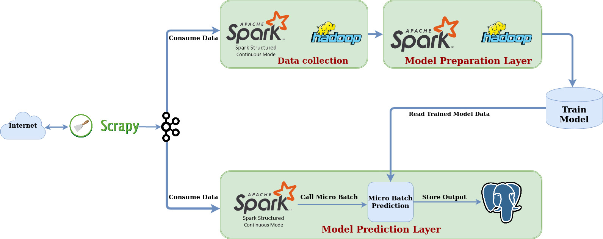
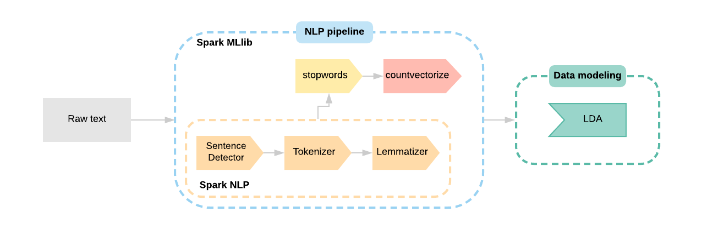

# Online LDA-Topic Modeling Algorithm in Pyspark
   Topic Modelling is a natural language processing task of identifying the probable topic that is being represented by the text in the document.To capture these kind of information into a mathematical model, Apache Spark MLlib provides Topic modelling using Latent Dirichlet Condition.
   

## Implementation

1. Problem Definition
    - Build a modular streaming online LDA-Topic Modeling pipeline 
    
2. Data Ingestion / Data Collection:
    ```
    news_sites ---> scrapy ---> spider pipeline ---> Kafka Producer ---> Kafka Stream --
                   -> Spark Structured Streaming Consumer ---> parquet file stored in HDFS              
   ```
3. Data Preparation 
   ```shell script
   read parquet file ---> documentAssembler---> sentenceDetector ---> tokenizer --
                     -> normalizer --> lemmatizer --> stopwords_cleaner --> ngrams_cum --
                     -> CountVectorizer --> Dataset
   ```

4. Model Training and store topic information
    ```shell script
   Dataset --> Online LDA Optimizer --> build model ---> Model Store
    --> build model --> get topic id with keywords --> stored postgres
    --> model run information --> stored postgres
                 
   ```

5. Prediction on Live Stream
   ```shell script
   Kafka Consumer --> Spark Streaming Consumer --> Foreach Batch --> DataFrame --> documentAssembler---> sentenceDetector
                 ---> tokenizer ---> normalizer --> lemmatizer --> stopwords_cleaner 
                 --> ngrams_cum ---> CountVectorizer --> Dataset -->  Read Model Data 
                 --> Predict topics --> Stored Postgres
                 
              
   ```
## Flow Diagram:



## Data Pre Processing Steps:



### Dataset tables:

|Table Name   |Info                               | 
|-------------|-----------------------------------|
|topics       |Store the topic id & bag of words |
|model_info   |Store model information            |
|model_result |Store model predicted output       |

------------------------------------------------------------------------------------------------------------------------
## How to run?

There are two ways of running, that is on docker or on your local machine. In either case, opening the terminal
is the difference, once the terminal is launched, the steps are common. 

Start the docker container, if needed:
```
docker run -v $(pwd):/host/ --hostname=$(hostname) -p 50075:50075 -p 50070:50070 -p 8020:8020 -p 2181:2181 -p 9870:9870 -p 9000:9000 -p 8088:8088 -p 10000:10000 -p 7077:7077 -p 10001:10001 -p 8080:8080 -p 9092:9092 -it sparkstructuredstreaming-pg:latest
```

To get a new terminal for our docker instance run : `docker exec -it $(docker ps | grep sparkstructuredstreaming-pg | cut -d' ' -f1) bash`
Note: We pull our container run id with `$(docker ps | grep sparkstructuredstreaming-pg | cut -d' ' -f1)`

This example needs multiple terminals:

- On each terminal move to the source root folder:
    ```shell script
    # Local machine
    cd /path/to/spark-streaming-playground/ 
    
    # On Docker 'spark-streaming-playground' is mountes as a volume at /host/
    cd /host  
    
    export PYTHONPATH=$(pwd)/src/:$PYTHONPATH
    ```

- Data collection
    -  collect data from news article & publisher this messgae into kafka producer    
    ```shell script
    export PYTHONPATH=$(pwd)/src/:$PYTHONPATH
    bin/data/start_kafka_scrapy.sh <Spider_name>
    
    example: bin/data/start_kafka_scrapy.sh indianexpress
    ```
    - available Spiders
    ```bash
     1. indianexpress
     2. newindianexpress
     3. theguardianSpider
     4. thehindu
     5. timesofindia
    ```
- Data preparation for model training & Train Model
    -  Load Data into HDFS Path
    ```bash
     bin/data/dump_raw_data_into_hdfs.sh 
     ```
    -  Start Model Train Job
    ```bash
     bin/models/online_lda_topic_modeling.sh
     ```
    
-  Topic Prediction on live stream Data
    ```shell script
    bin/analytics/online_lda_topic_modeling.sh
    ```
------------------------------------------------------------------------------------------------------------------------

**References**
- [https://medium.com/zero-gravity-labs/lda-topic-modeling-in-spark-mllib-febe84b9432](https://medium.com/zero-gravity-labs/lda-topic-modeling-in-spark-mllib-febe84b9432)
- [https://medium.com/@ianshan0915/topic-modeling-on-large-scale-corpus-with-spark-9af45b5de603](https://medium.com/@ianshan0915/topic-modeling-on-large-scale-corpus-with-spark-9af45b5de603)
