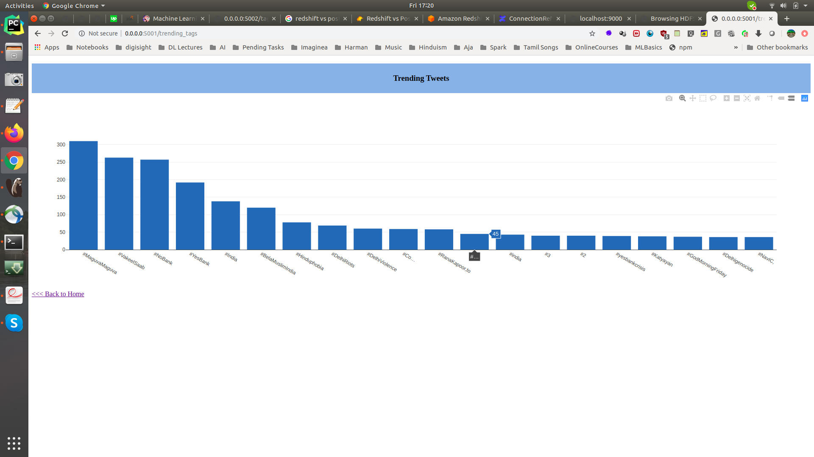

# Use Case : Trending Twitter Hash Tags

`Bronze Lake -> Spark Structured Streaming Parquet Source -> Extract Hash Tags with UDF -> Spark Structured Streaming Postgresql Sink`

`Postgresql -> Flask REST API -> Web Application`

Note: We pull our container run id with `$(docker ps | grep sparkstructuredstreaming-pg | cut -d' ' -f1)`

To get a new terminal for our docker instance run : `docker exec -it $(docker ps | grep sparkstructuredstreaming-pg | cut -d' ' -f1) bash`

```
cd /path/to/ # Local machine
cd /host  # Docker
#[hashtag] Guake terminal name! 
    bin/trending_tweet_hashtags.sh

#[dashboard] Guake terminal name! 
    bin/dashboard.sh
```
 
Head to http://0.0.0.0:5001/ for live count on the trending #hashtags
 