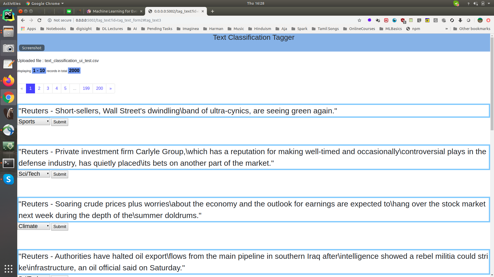

# Use Case : Streaming ML Classification with Active Learning Model
- In this use case we are gonna build ground up dataset from scratch from live streaming data. 
- Use programmatic methods to tag dataset, create golden dataset for ML training, 
in an iterative manner till we are satisfied with model performance.
- Build model and evaluate it on golden dataset
- Deploy the model, classify the text
- Extract the web links from tweets and store the urls

## Implementation

```
Tweets -> Twitter Stream -> Tweepy -> Producer -> Kafka -> Consumer -> Spark Structured Streaming -> Postgresql as one single table

Posgresql -> Raw Dataset Table -> SSPLabeler -> Train/Test/Dev/Snorkel dataset tables -> Snorkel Labeler -> Train models 

```
## Dataset
We are interested to collect tweets that talks about Artificial Intelligence / Data Science in general.

Dataset creation involves:
- Observer the Tweets
- Sample relevant tweets, with possible false positive data (i.r irrelevant tweets)
- Dataset of format `parquet` with text column and label column. (parquet nicely packs special characters without the headache os parsing the CSV files)
- Data splits

Run..

```
#by default 20mins of tweets will be collected and dumbed into the table
bin/dump_raw_data_into_postgresql.sh
#Reads the table as pandas dataframe, applies naive labelling, prepares the dataset needed for Text classifier and snorkel labelling 
bin/prepare_ssp_dataset.sh
```

creates dataset @ [data/dataset/ssp/original](../../data/dataset/ssp/original)

|File Name|Records|Info|Columns|
|---------|-------|----|------|
|ssp_tweet_dataset.parquet| 30K+|Full Raw Dataset|['created_at', 'text', 'source', 'expanded_url', 'media_url_https']|
|ssp_train_dataset.parquet | 27K+|Train Data|['created_at', 'text', 'source', 'expanded_url', 'media_url_https']|
|ssp_LF_dataset.parquet|1000|Snorkell Dataset|["id", "text"]|
|ssp_test_dataset.parquet | 1000| Test Data|["id", "text"]|
|ssp_val_dataset.parquet | 500|Validation Data|["id", "text"]|


## Labeling
```
Raw Data -> Run python code to tag programmatically -> Vanilla Version -> Tagger -> Golden Version (small dataset) 

Golden Version (small dataset) -> Snorkel -> Labeling Functions -> Model -> Large Labelled Dataset -> (Optional) Tagger
    Labeling Functions -> Regex Rules
                       -> Clustering Models

Large Labelled Dataset -> ML Model -> Prediction
```
 
- **Tagger**

    - Mannual annotation plays a major role in ML pipeline, where humans needs to infuse domain information in to ML model.
    - Though there are more advanced tools like [https://prodi.gy/](https://prodi.gy/), I wanted to keep things tiddy and simple, 
    so a web tool has been put in place to get a hands on experience in tagging with respect to text classification.
    
    `bin/tagger.sh`
    
    In this tool, you can:
        - Upload multiple CSV/Parquet(preffered) data files with columns [id, text] and corresponding
         CSV lable files with columns [lable, index]
        - Tag each of the data files independently
        - Download the files (as matter of fact the files lives in your home folder ;) )
    
    Main screen...
    
    
    Upload CSV data...
    
    
    Upload Labels file...
    
    
    Main Tagger Screen...
    
    
- **[Snorkel](https://www.snorkel.org/)**
    A semi automated way of preparing the dataset at scale for later use.

    `bin/models/run_snorkel_labeeler.sh`

## Text Classifier Training

**Naive DL Classifier**

```
 bin/models/build_naive_dl_text_classifier.sh 
```

## API Server

TODO

## Spark Streaming Application for Classification

TODO

## Text Dashboard


### References
- https://towardsdatascience.com/custom-transformers-and-ml-data-pipelines-with-python-20ea2a7adb65